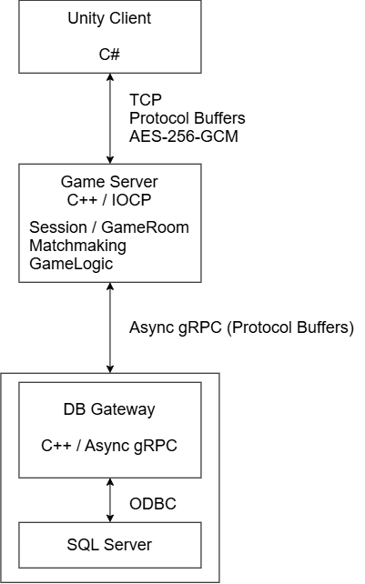

# MiniGame Partyroom

> C++ IOCP 게임 서버와 Unity 클라이언트로 구현한 실시간 멀티플레이 미니게임 프로젝트입니다.
>
> Race, PingPong, 호박쪼개기 3종의 실시간 멀티플레이 게임을 하나의 서버와 클라이언트에서 플레이할 수 있도록 구성했습니다.

---

## 1. 프로젝트 개요

| 항목 | 내용 |
|---|---|
| **개발 기간** | 2025.07 ~ 2026.01 |
| **개발 인원** | 1인 |
| **Server** | C++17 / IOCP |
| **Client** | Unity / C# |
| **Database** | SQL Server / ODBC |
| **Server ↔ DB** | Async gRPC |
| **Serialization** | Protocol Buffers |
| **Game** | Race / PingPong / 호박쪼개기 |

### 주요 구현

- Overlapped I/O 기반 IOCP Multiplayer Server 구조 적용
- Actor 기반 GameRoom Event Processing
- Unity / C# Client 및 TCP Network Layer
- Protocol Buffers 기반 Client / Server Protocol
- Async gRPC 기반 DB Gateway 분리
- RSA + AES-256-GCM 기반 Session 암호화
- Session State 기반 Packet Validation
- Elo 기반 Matchmaking
- 게임 특성에 따른 State Synchronization
- Network Thread → Unity Main Thread Job Queue
- AWS 환경에서의 Server 배포 경험

> IOCP Network 구조, Actor 기반 Event Processing, Windows SLIST 기반 Object Pool은 게임 서버 구조를 학습하는 과정에서 익힌 내용을 프로젝트에 적용한 부분입니다.  
> 이를 기반으로 프로젝트에 필요한 Protocol, DB Gateway, Session 보안, Matchmaking 및 각 MiniGame의 Server / Client Logic을 구성했습니다.

---

## 2. 데모

> 플레이 영상 링크

| Race | PingPong | 호박쪼개기 |
|---|---|---|
| Screenshot / GIF | Screenshot / GIF | Screenshot / GIF |

---

## 3. Tech Stack

| Area | Technology |
|---|---|
| **Game Server** | C++17, IOCP, Winsock |
| **Client** | Unity, C# |
| **Serialization** | Protocol Buffers |
| **Server ↔ DB** | gRPC |
| **Database** | SQL Server, ODBC |
| **Encryption** | RSA, AES-256-GCM |

---

## 4. Architecture



Game Server가 SQL Server에 직접 접근하지 않고 별도의 DB Gateway를 거치도록 구성했습니다.

실시간 Game Logic을 처리하는 Worker Thread가 DB I/O를 직접 수행하거나 응답을 기다리지 않도록 Game Server와 DB 영역을 분리했습니다.

---

## 5. Engineering Highlights

### 5-1. IOCP 기반 Networking

Windows 환경에서 Overlapped I/O와 IOCP를 기반으로 한 비동기 Network 구조를 학습하고 프로젝트에 적용했습니다.

`CompletionPortCore`, `Session`, `Listener`, `RecvBuffer`, `SendBuffer`, `SendBufferChunk`, `ServerService` 등의 Network Component를 기반으로 Connection, Recv / Send 흐름을 구성했습니다.

`Session`은 Socket의 연결 상태와 비동기 Recv / Send를 관리하고, `Listener`는 `AcceptEx`를 통해 Client Connection을 수락합니다.

상위 계층에서는 `PBSession`이 Packet Header를 해석하고 Protocol Buffers Message를 처리하도록 구성하여 기본 Network Layer와 Packet Serialization 영역을 분리했습니다.

Client C# 코드에서도 Server와 동일한 Packet Header 구조를 사용하도록 구성했습니다.

```text
Packet

| 2Byte        | 2Byte        |       ...       |
┌──────────────┬──────────────┬─────────────────┐
│ Packet Size  │  Packet ID   │ Protobuf Data   │
└──────────────┴──────────────┴─────────────────┘
```

#### Object Pool

반복적으로 생성되는 Actor Event 등의 객체에는 학습한 Windows SLIST 기반 Object Pool 구조를 적용했습니다.

고빈도로 사용되는 객체를 매번 새로 할당하기보다 Pool에서 가져오고 반환하여 재사용하도록 구성했습니다.

---

### 5-2. Actor Event Processing

여러 객체를 Multi-thread 환경에서 처리하기 위해 Actor 기반 Event Processing 구조를 학습하고 프로젝트에 적용했습니다.

임의의 객체의 상태를 여러 Worker Thread가 직접 변경하지 않고, 해당 객체에 대한 작업을 Event Queue에 전달합니다.

```text
Network Event
     │
     ▼
PostEvent()
     │
     ▼
Actor Event Queue
     │
     ▼
Worker Thread
     │
     ▼
Actor Logic
```

해당 Actor를 배정받은 Worker Thread는 Event Queue를 순차적으로 처리하며, 하나의 Actor가 동시에 여러 Worker Thread에서 실행되지 않도록 구성했습니다.

또한 하나의 Actor가 Worker Thread를 장시간 점유하지 않도록 일정 시간 동안 Event를 처리한 뒤 남은 작업이 있으면 다시 공유 Queue에 등록합니다.

이를 통해 특정 Actor의 작업량이 많더라도 다른 Actor들이 처리 기회를 얻을 수 있도록 구성했습니다.

---

### 5-3. Async DB Gateway

로그인, Player Record 저장 등의 DB 작업을 Game Server에서 직접 수행할 경우 Blocking DB I/O가 실시간 Game Logic 처리에 영향을 줄 수 있다고 판단했습니다.

따라서 DB 접근을 별도의 C++ DB Gateway로 분리했습니다.

```text
Game Server
     │
     │ Async gRPC Request
     ▼
DB Gateway
     │
     │ ODBC
     ▼
SQL Server
```

Game Server에서는 gRPC `CompletionQueue`를 이용한 비동기 요청 구조를 사용하여 DB Request를 전송한 뒤 Worker Thread가 결과를 직접 기다리지 않도록 구성했습니다.

DB Gateway에서는 Async gRPC Server를 구성하고 여러 Worker Thread가 RPC 요청을 처리하도록 했습니다.

SQL Server Connection은 ODBC를 사용하며, Connection Handle을 Pool로 관리하여 재사용하도록 구성했습니다.

DB 작업 과정에서는 RAII 기반 Guard를 사용해 Handle 반환이나 Transaction Rollback과 같은 Cleanup이 Scope 종료 시 처리되도록 구성했습니다.

---

### 5-4. Session Security

#### RSA → AES-256-GCM Handshake

최초 Connection 단계에서 Server가 RSA Public Key를 전달하고, Client가 생성한 AES Session Key를 해당 Public Key로 암호화하여 Server에 전달하도록 구성했습니다.

이후 암호화가 필요한 Packet은 AES-256-GCM으로 감싸 전달할 수 있도록 구성했습니다.

```text
Server
  │
  │ RSA Public Key
  ▼
Client
  │
  │ Generate AES Session Key
  │
  │ Encrypt with RSA Public Key
  ▼
Server
  │
  │ Decrypt AES Session Key
  ▼

AES-256-GCM Session
```

Handshake 이후에는 Client와 Server가 공유한 AES Session Key를 이용해 필요한 Packet을 암호화합니다.

AES-GCM의 인증 기능을 통해 암호화된 Payload의 무결성도 함께 검증하도록 구성했습니다.

```text
Plain Packet

| 2Byte        | 2Byte        |       ...       |
┌──────────────┬──────────────┬─────────────────┐
│ Packet Size  │  Packet ID   │ Protobuf Data   │
└──────────────┴──────────────┴─────────────────┘

Encrypted Packet Wrapper

| 2Byte        | 2Byte        |                                             ... |
┌──────────────┬──────────────┬─────────────────────────────────────────────────┐
│ Packet Size  │  Packet ID   │ iv / ciphertext / tag / msgId                   │
└──────────────┴──────────────┴─────────────────────────────────────────────────┘

Packet ID
→ Encrypted Client / Server Wrapper Packet Type

msgId
→ 암호화된 원본 Packet Type이며 AAD에도 사용
```

Packet의 Message ID는 AAD에 포함하여 암호화된 Payload와 Packet Type 간의 무결성 검증에도 활용했습니다.

#### Session State 기반 Packet Validation

Client가 현재 Session State에서 허용되지 않는 Packet을 전송하지 못하도록 Packet ID를 Session State에 따라 제한했습니다.

```text
Before Handshake
       ↓
Before Login
       ↓
Lobby
       ↓
┌──────┼─────────┐
Race PingPong 호박쪼개기
```

예를 들어 다음과 같은 요청은 Server에서 차단합니다.

- Login 이전의 Game Packet 전송
- Race 진행 중 PingPong Packet 전송
- 현재 Session State에서 허용되지 않은 Packet ID 전달

비정상 Packet 전달이 반복될 경우 Suspicious Count를 증가시키고 일정 횟수 이상 누적되면 Connection을 종료하도록 구성했습니다.

---

### 5-5. Matchmaking

Player의 Elo를 기준으로 비슷한 수준의 Player를 우선적으로 찾는 Matchmaking을 구현했습니다.

Matchmaking 입력과 실제 탐색 Queue를 분리하여 새로운 요청의 입력과 Match 후보 탐색 과정이 직접 경쟁하는 상황을 줄이도록 구성했습니다.

```text
Match Request
     │
     ▼
Temporary Queue
     │
     ▼
Flush / Sort
     │
     ▼
Search Queue
     │
     ▼
Match Group
     │
     ▼
GameRoom
```

Match가 성립된 이후에는 Player의 Loading Progress를 동기화하고, 모든 Player가 준비된 이후 Game을 시작합니다.

Matchmaking 중 Player가 Connection을 유지하지 못한 경우 남은 Player는 다시 Matchmaking 대상으로 돌려보내도록 처리했습니다.

---

### 5-6. Game Synchronization

각 MiniGame은 Game State의 변화 방식과 Network 요구사항이 다르기 때문에 동일한 Synchronization 방식을 일괄적으로 적용하지 않았습니다.

| Game | 주요 동기화 대상 | 접근 방식 |
|---|---|---|
| **Race** | 연속적인 Player Movement | Server State + Client Interpolation |
| **PingPong** | 빠른 Object / Collision | Server State + Client Event |
| **호박쪼개기** | Slot / Hit Event | Event 중심 State Broadcast |

#### Race

Race는 Player의 위치와 회전이 지속적으로 변경되는 게임이기 때문에 세 게임 중 가장 많은 상태 동기화가 필요했습니다.

Server의 Player State를 기준으로 하되, 다른 Player의 화면상 Movement가 Network Update마다 끊어져 보이지 않도록 Client에서 위치와 회전을 보간했습니다.

```text
Server Position
      │
      ▼
Client Real Position
      │
      ▼
Interpolation
      │
      ▼
Displayed Position
```

Server로부터 받은 실제 위치와 화면에 표시하는 위치를 분리하고, Display Position이 실제 상태를 부드럽게 추적하도록 구성했습니다.

이를 통해 Server에서 관리하는 State를 기준으로 하면서 다른 Player의 움직임이 부드럽게 표시되도록 했습니다.

#### PingPong

PingPong은 빠르게 이동하는 Object와 Collision 처리가 중요한 게임입니다.

Server가 주요 Game Object의 State를 관리하고, Client에서 발생한 Collision Event를 Server에 전달하면 Server가 이를 바탕으로 Game State를 갱신하도록 구성했습니다.

Race처럼 모든 Player Movement를 지속적으로 보간하기보다 게임 진행에 중요한 Object와 Event의 동기화에 집중했습니다.

#### 호박쪼개기

호박쪼개기는 연속적인 물리 Movement보다 특정 Slot에서 발생하는 Event가 중요한 게임입니다.

Server가 Slot State를 관리하고 Client가 발생시킨 Hit Event를 전달받아 결과를 처리한 뒤 변경된 상태를 다시 Client에 Broadcast하도록 구성했습니다.

---

## 6. Unity Client

Unity / C#으로 Lobby와 3종 MiniGame의 Client를 구현했습니다.

### Main Thread Dispatch

Socket Receive는 별도의 Network Thread에서 수행하지만 Unity API는 Main Thread에서 실행해야 합니다.

따라서 Network Thread에서 수신한 Packet을 즉시 Scene에 적용하지 않고 Main Thread Job Queue로 전달하도록 구성했습니다.

```text
Socket Thread
     │
     ▼
Packet Handler
     │
     ▼
ExecuteAtMainThread()
     │
     ▼
Main Thread Job Queue
     │
     ▼
Unity Scene
```

이를 통해 Network Thread와 Unity Scene Logic의 실행 영역을 분리했습니다.

### Network Manager

Network Manager는 기능 영역에 따라 분리했습니다.

- Lobby
- Match
- Loading
- Race
- PingPong
- 호박쪼개기

각 Game에서 필요한 Packet Handler와 상태 처리를 해당 영역에서 관리하도록 구성했습니다.

Client에서도 반복적으로 생성되는 GameObject에 Object Pool을 적용했습니다.

---

## 7. Design Constraints & Improvements

이 프로젝트는 게임 서버의 기본 구조를 학습하고 실제 Multiplayer Game에 적용하는 것을 주요 목표로 진행했습니다.

현재 구조에는 다음과 같은 개선 가능성이 남아 있습니다.

- 실제 동시 접속자 수와 Packet 처리량에 대한 부하 테스트 미진행
- 구조화된 Logging / Monitoring System 부재
- 자동화된 Test Pipeline 부재
- 단일 Game Server 중심의 구조로 수평 확장 미지원
- 일부 Protocol ID가 C++과 Protobuf에 중복 정의되어 수동 동기화 필요
- Process 내부에 관리하는 일부 Cache를 Server 확장 시 외부 Cache로 분리할 필요
- 개발 초기의 문자 인코딩 처리 방식 개선 필요

기능을 추가하는 것뿐 아니라 현재 구조의 한계를 파악했고, 이후 프로젝트에서는 이러한 경험을 바탕으로 서버 구조와 배포 방식을 발전시켰습니다.

---
